filePath: z:\home\yip\Projects\wall-x\wall_x\model\qwen2_5_based\modeling_qwen2_5_vl_act.py
          
# `generate_flow_action` 函数详细流程原理分析

## 函数概述

`generate_flow_action` 函数实现了一个基于 ODE (Ordinary Differential Equation) 积分的动作生成流程，用于生成连续动作序列。该函数是 Qwen2.5 视觉-语言模型在动作控制任务中的核心组件。

## 详细流程分析

### 1. 初始化与配置阶段

1. **计时初始化**：记录开始时间，创建计时结果字典
2. **批量大小确定**：根据输入 IDs 或输入嵌入确定批量大小
3. **参数配置**：设置输出注意力、隐藏状态和返回字典等参数

### 2. 输入嵌入处理阶段

1. **文本嵌入**：通过 `model.embed_tokens` 处理输入 IDs
2. **图像嵌入**：
   - 处理像素值，生成图像特征
   - 验证图像特征与图像 token 数量匹配
   - 将图像特征替换到对应 token 位置
3. **视频嵌入**：类似图像嵌入处理
4. ** proprioception 处理**：
   - 处理状态信息，生成 proprioception 嵌入
   - 替换到对应 token 位置
5. **注意力掩码处理**：确保掩码在正确设备上

### 3. 位置编码处理阶段

1. **RoPE 索引计算**：
   - 预填充阶段计算 RoPE 索引
   - 后续使用预计算的 rope deltas
2. **专家分组索引**：
   - 计算每个专家组的 token 数量
   - 确定每个专家组的起始和结束索引

### 4. 动作初始化阶段

1. **噪声生成**：创建随机噪声作为初始动作
2. **时间步长处理**：
   - 生成时间步长序列
   - 计算时间步长间隔
3. **动作预处理**：
   - 通过 `action_preprocessor.step` 处理噪声动作
   - 生成动作嵌入和条件信息
4. **动作嵌入替换**：将动作嵌入替换到对应 token 位置

### 5. 预取前向传播阶段

1. **模型前向传播**：执行模型前向传播，获取隐藏状态和 KV 缓存
2. **动作预测**：
   - 提取动作隐藏状态
   - 通过 `action_proj_back` 预测动作
   - 计算初始速度 v_0
3. **填充动作处理**：处理填充动作（如果提供）
4. **动作更新**：根据初始速度更新噪声动作

### 6. 缓存预处理阶段

1. **前缀长度确定**：确定动作 token 的位置
2. **KV 缓存处理**：
   - 处理不同版本的 transformers KV 缓存格式
   - 截断 KV 缓存到前缀长度
3. **后缀部分分割**：
   - 分割位置 IDs、输入嵌入、注意力掩码等
   - 重新计算专家分组索引
4. **注意力掩码构建**：
   - 创建后缀部分的注意力掩码
   - 应用因果掩码（如果配置）
   - 处理填充位置

### 7. ODE 积分阶段

1. **步进函数定义**：
   - 定义 `step_with_kvcache` 函数
   - 处理动作 token，生成动作嵌入
   - 执行模型前向传播，预测动作速度
2. **ODE 积分执行**：
   - 使用欧拉方法执行 ODE 积分
   - 生成动作轨迹

### 8. 后处理阶段

1. **最终动作获取**：获取轨迹的最后一个动作作为预测动作
2. **动作反归一化**：如果需要，反归一化动作
3. **真实动作处理**：如果提供，处理真实动作
4. **计时结果记录**：记录总时间和各阶段时间

### 9. 结果返回

返回包含预测动作、真实动作（如果提供）和计时结果的字典

## 核心技术原理

1. **扩散模型思想**：使用噪声初始化动作，通过逐步去噪生成最终动作
2. **ODE 积分**：使用欧拉方法求解微分方程，模拟动作随时间的演变
3. **KV 缓存优化**：利用前缀 KV 缓存加速推理
4. **多模态融合**：整合文本、图像、视频和状态信息
5. **专家混合**：使用 MoE (Mixture of Experts) 架构处理不同类型的输入

## 流程图

```mermaid
flowchart TD
    subgraph 初始化与配置
        A[开始计时] --> B[确定批量大小]
        B --> C[配置输出参数]
    end
    
    subgraph 输入嵌入处理
        C --> D[文本嵌入处理]
        D --> E{有图像输入?}
        E -->|是| F[图像嵌入处理]
        E -->|否| G{有视频输入?}
        F --> G
        G -->|是| H[视频嵌入处理]
        G -->|否| I{有状态信息?}
        H --> I
        I -->|是| J[状态信息处理]
        I -->|否| K[注意力掩码处理]
        J --> K
    end
    
    subgraph 位置编码处理
        K --> L[计算RoPE索引]
        L --> M[计算专家分组索引]
    end
    
    subgraph 动作初始化
        M --> N[生成随机噪声]
        N --> O[处理时间步长]
        O --> P[动作预处理]
        P --> Q[动作嵌入替换]
    end
    
    subgraph 预取前向传播
        Q --> R[模型前向传播]
        R --> S[提取动作隐藏状态]
        S --> T[预测动作]
        T --> U[计算初始速度v_0]
        U --> V{有填充动作?}
        V -->|是| W[处理填充动作]
        V -->|否| X[更新噪声动作]
        W --> X
    end
    
    subgraph 缓存预处理
        X --> Y[确定前缀长度]
        Y --> Z[处理KV缓存]
        Z --> AA[分割后缀部分]
        AA --> AB[重新计算专家分组索引]
        AB --> AC[构建注意力掩码]
    end
    
    subgraph ODE积分
        AC --> AD[定义步进函数]
        AD --> AE[执行ODE积分]
    end
    
    subgraph 后处理
        AE --> AF[获取最终预测动作]
        AF --> AG{需要反归一化?}
        AG -->|是| AH[反归一化动作]
        AG -->|否| AI{有真实动作?}
        AH --> AI
        AI -->|是| AJ[处理真实动作]
        AI -->|否| AK[记录计时结果]
        AJ --> AK
    end
    
    AK --> AL[返回结果]
```

## 技术要点分析

1. **动作生成机制**：
   - 使用随机噪声作为初始动作
   - 通过 ODE 积分逐步优化动作
   - 利用模型预测动作速度，指导动作演变

2. **多模态融合**：
   - 整合文本、图像、视频和状态信息
   - 通过 token 替换方式将不同模态信息融入输入嵌入

3. **推理优化**：
   - 利用 KV 缓存减少重复计算
   - 分割前缀和后缀，只处理必要部分

4. **时间步长管理**：
   - 生成线性时间步长序列
   - 使用欧拉方法进行数值积分

5. **专家混合架构**：
   - 计算专家分组索引
   - 为不同类型的输入分配不同专家

## 代码优化建议

1. **性能优化**：
   - 考虑使用更高效的 ODE 积分方法，如 Runge-Kutta
   - 优化 KV 缓存处理，减少内存使用

2. **代码可读性**：
   - 提取重复代码为单独函数，如嵌入处理部分
   - 添加更详细的注释，特别是关键算法部分

3. **鲁棒性**：
   - 增加更多的输入验证和错误处理
   - 添加类型注解，提高代码可维护性

4. **灵活性**：
   - 考虑支持更多的 ODE 积分方法
   - 增加配置选项，允许用户自定义时间步长策略

## 总结

`generate_flow_action` 函数是一个复杂但强大的动作生成组件，结合了扩散模型、ODE 积分和多模态融合技术。它通过逐步优化噪声动作，生成高质量的连续动作序列，适用于需要精确动作控制的任务。

该函数的设计体现了现代 AI 模型在处理连续控制任务时的先进思路，特别是将语言模型与控制理论相结合的方法，为未来的多模态控制模型提供了有价值的参考。