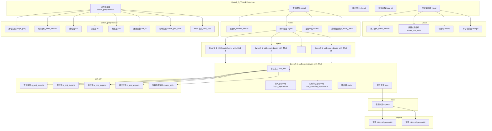

# Qwen2_5_VLMoEForAction 模型结构



## 模型结构说明

### 1. 主模型组件
- **视觉编码器 (visual)**：处理输入图像，提取视觉特征
- **语言模型 (model)**：处理文本输入，生成文本输出
- **输出层 (lm_head)**：将语言模型的输出转换为词表概率分布
- **损失函数 (loss_fct)**：计算训练过程中的损失
- **动作处理器 (action_preprocessor)**：处理动作相关的输入和输出

### 2. 视觉编码器
- **补丁嵌入 (patch_embed)**：将图像分割为补丁并嵌入为向量
- **旋转位置编码 (rotary_pos_emb)**：为视觉特征添加位置信息
- **视觉块 (blocks)**：包含 32 个视觉注意力块，提取视觉特征
- **补丁合并器 (merger)**：合并视觉补丁特征

### 3. 语言模型
- **词嵌入 (embed_tokens)**：将输入词转换为向量表示
- **解码器层 (layers)**：包含 36 个解码器层，每个层包含自注意力和前馈网络
- **层归一化 (norms)**：对输入进行层归一化
- **旋转位置编码 (rotary_emb)**：为文本特征添加位置信息

### 4. 解码器层
- **自注意力 (self_attn)**：处理序列内的依赖关系
  - **查询/键/值/输出投影 (q/k/v/o_proj_experts)**：每个都包含 2 个专家
- **输入层归一化 (input_layernorms)**：对输入进行层归一化
- **注意力后层归一化 (post_attention_layernorms)**：对注意力输出进行层归一化
- **路由器 (router)**：根据输入令牌类型选择专家
- **混合专家 (moe)**：包含 2 个专家，根据路由器的输出加权组合

### 5. 动作处理器
- **属性投影 (propri_proj)**：处理动作属性输入
- **时间嵌入 (time_embed)**：为动作添加时间信息
- **线性层 (w1, w2, w3)**：处理动作特征
- **激活函数 (act_fn)**：引入非线性
- **动作投影 (action_proj_back)**：将特征转换为动作输出
- **MSE 损失 (mse_loss)**：计算动作预测的损失

## LoRA 微调建议

对于全量 LoRA 微调，建议包含以下目标模块：

```yaml
lora_target_modules: [
  "embed_tokens",
  "q_proj_experts",
  "k_proj_experts",
  "v_proj_experts",
  "o_proj_experts",
  "moe.experts",
  "lm_head",
  "action_preprocessor"
]
```

这样可以对模型的所有关键组件进行 LoRA 微调，同时保持计算效率。