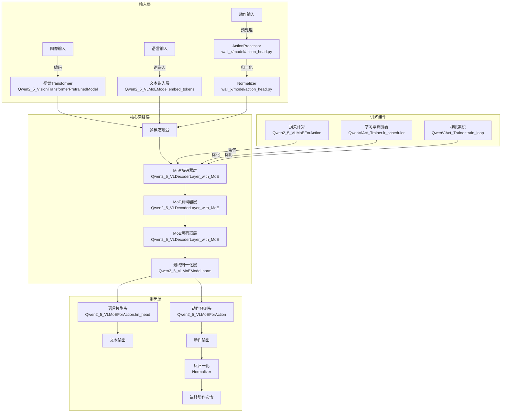
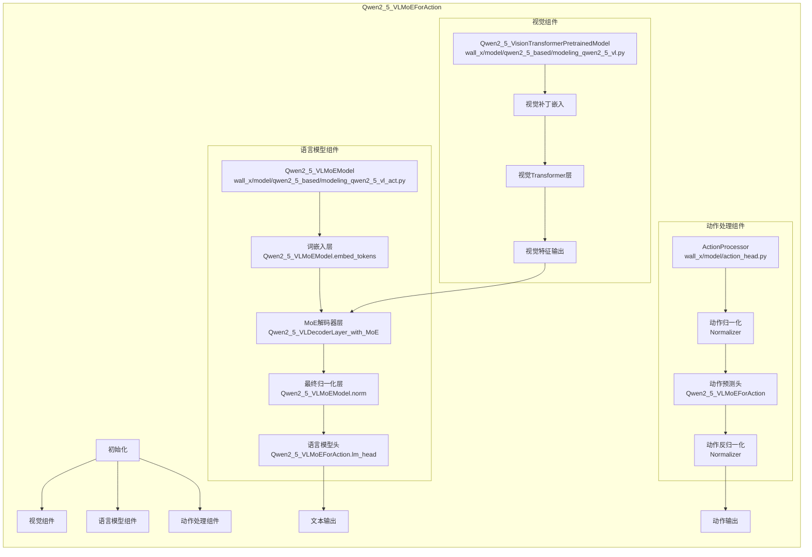
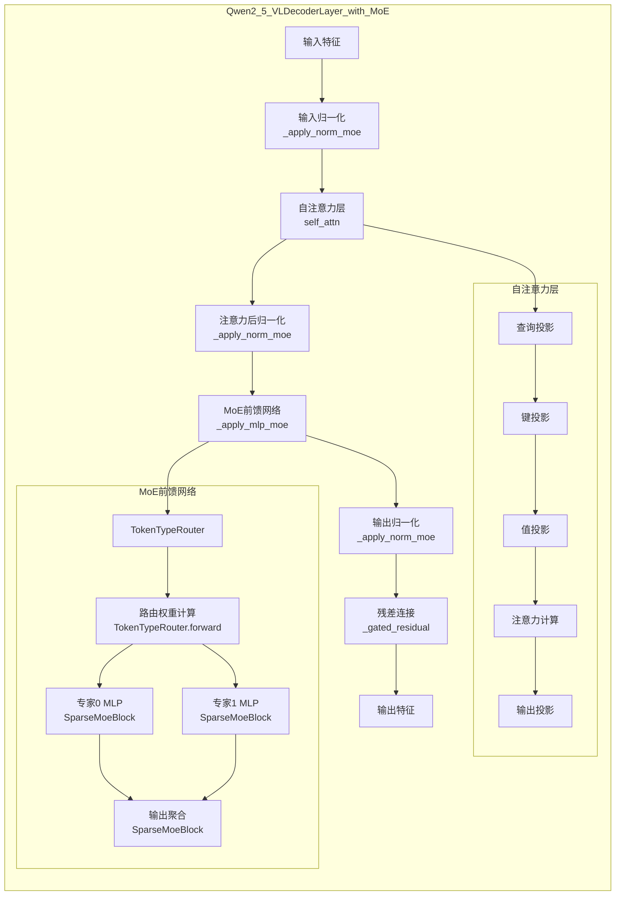
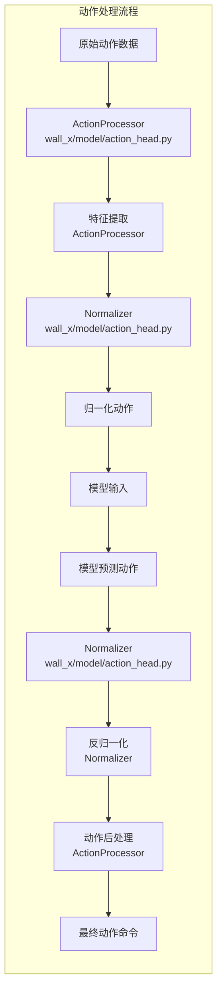
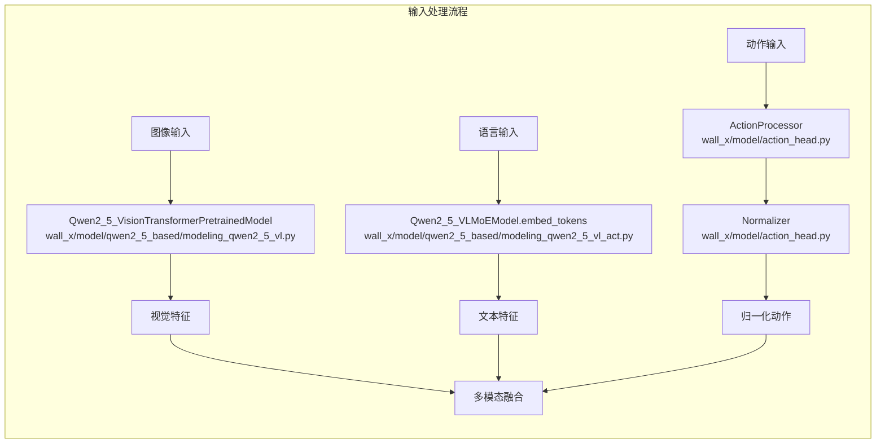
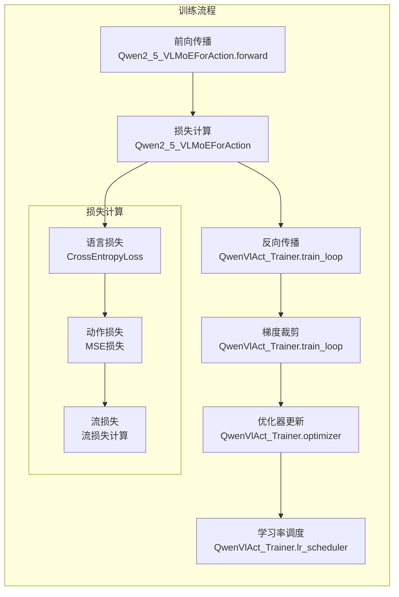

# Wall-X 模型网络结构图（含代码对应关系）

## 模型整体架构

## 核心组件详细结构

### 1. Qwen2_5_VLMoEForAction 详细结构

### 2. MoE解码器层详细结构

### 3. 动作处理流程

## 数据流详细分析

### 1. 输入处理流程

### 2. 训练流程

## 核心组件代码对应表

| 模块 | 代码对应 | 文件路径 |
|------|---------|---------|
| 视觉Transformer | Qwen2_5_VisionTransformerPretrainedModel | wall_x/model/qwen2_5_based/modeling_qwen2_5_vl.py |
| 文本嵌入层 | Qwen2_5_VLMoEModel.embed_tokens | wall_x/model/qwen2_5_based/modeling_qwen2_5_vl_act.py |
| ActionProcessor | ActionProcessor | wall_x/model/action_head.py |
| Normalizer | Normalizer | wall_x/model/action_head.py |
| Qwen2_5_VLMoEModel | Qwen2_5_VLMoEModel | wall_x/model/qwen2_5_based/modeling_qwen2_5_vl_act.py |
| Qwen2_5_VLDecoderLayer_with_MoE | Qwen2_5_VLDecoderLayer_with_MoE | wall_x/model/qwen2_5_based/modeling_qwen2_5_vl_act.py |
| TokenTypeRouter | TokenTypeRouter | wall_x/model/vla_mixin.py |
| SparseMoeBlock | SparseMoeBlock | wall_x/model/vla_mixin.py |
| Qwen2_5_VLMoEForAction | Qwen2_5_VLMoEForAction | wall_x/model/qwen2_5_based/modeling_qwen2_5_vl_act.py |
| QwenVlAct_Trainer | QwenVlAct_Trainer | wall_x/trainer/qwen_vl_act_trainer.py |

## 关键方法代码对应表

| 方法 | 代码对应 | 文件路径 |
|------|---------|---------|
| 输入归一化 | _apply_norm_moe | wall_x/model/qwen2_5_based/modeling_qwen2_5_vl_act.py |
| 自注意力计算 | self_attn.forward | wall_x/model/qwen2_5_based/modeling_qwen2_5_vl_act.py |
| MoE前馈网络 | _apply_mlp_moe | wall_x/model/qwen2_5_based/modeling_qwen2_5_vl_act.py |
| 残差连接 | _gated_residual | wall_x/model/qwen2_5_based/modeling_qwen2_5_vl_act.py |
| 训练循环 | train_loop | wall_x/trainer/qwen_vl_act_trainer.py |
| 验证循环 | val_loop | wall_x/trainer/qwen_vl_act_trainer.py |
| 模型加载 | load_model | wall_x/trainer/qwen_vl_act_trainer.py |
| 数据加载 | load_qact_data | wall_x/trainer/qwen_vl_act_trainer.py |

## 技术特点总结

1. **混合专家架构**：通过MoE实现不同类型输入的专门处理，提高模型效率
2. **多模态融合**：无缝整合视觉、语言和动作信息，实现端到端的机器人控制
3. **动作序列建模**：通过流损失增强动作序列的平滑性和一致性
4. **分布式训练支持**：支持FSDP和混合精度训练，适应大规模模型
5. **灵活的优化策略**：对动作专家使用不同的学习率，加速动作预测能力的学习

## 代码优化建议

1. **内存优化**：
   - 实现更高效的MoE路由缓存，减少重复计算
   - 考虑使用梯度检查点的更精细控制，平衡内存使用和计算效率

2. **推理加速**：
   - 实现专家缓存机制，避免重复计算
   - 考虑使用量化技术减少推理时的内存占用

3. **模型架构改进**：
   - 探索不同的专家数量和路由策略，找到最佳配置
   - 考虑引入更复杂的多模态融合机制，如交叉注意力

4. **训练稳定性**：
   - 实现更robust的损失计算，处理极端情况
   - 增加更多的训练监控指标，如专家平衡度等

5. **代码可读性**：
   - 增加更多的文档字符串和注释
   - 重构一些复杂的函数，提高代码可维护性

## 总结

Wall-X模型是一个复杂而强大的视觉-语言-动作模型，通过MoE架构实现了高效的多模态处理。本详细网络结构图展示了模型的内部组件、数据流和处理流程，并标记了每个模块对应的代码位置，帮助您更好地理解模型的工作原理和实现细节。

该模型的设计考虑了实际机器人控制的需求，通过整合视觉理解、语言处理和动作预测能力，为机器人控制任务提供了端到端的解决方案。其MoE架构使其能够高效处理不同类型的输入，而多模态融合机制则确保了信息的有效整合。

通过不断优化和扩展，Wall-X模型有潜力成为机器人控制领域的重要技术基础，为各种机器人平台提供智能、灵活的控制能力。